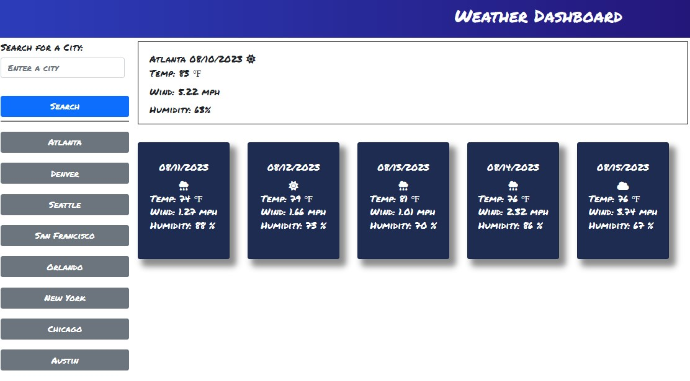
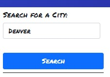

# my-weather-app-3000

## Description

- This app was made with the intent on gaining real world experience with making API
  calls using the fetch function. This app has many features and buttons
  that will render the weather for selected city. The overall outcome, is to
  get the current weather and the forecast for the next five days based on the city
  you selected.

### Usage

- This app has only two user interactions within the interface. the first is an input box
  where you can enter the city name that you want to display the weather.
- The second interaction are the city buttons below the search element.
  When you click on any of these buttons, the respective city weather is displayed
  on the right.

### Screenshots

### Links

- GitHub link: https://github.com/Sal1316/my-weather-app-3000

- Deployed site: https://sal1316.github.io/my-weather-app-3000
